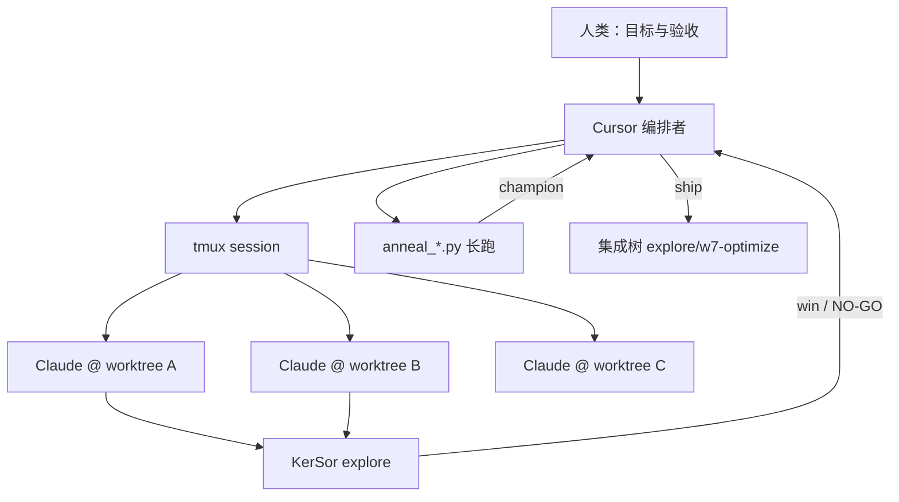

# tmux + Claude Code 编排手册

> 适用范围：本仓库 VLIW 优化实验，沉淀自 `1230 → 1085` 全程。
> 与 [`47-cursor-experiment-agentic-playbook.md`](47-cursor-experiment-agentic-playbook.md) 互补：
> **47 讲「搜什么、怎么验」；48 讲「怎么开 agent、怎么并行、怎么收网」。**

---

## 1. 角色分工

| 角色 | 工具 | 职责 |
|------|------|------|
| **人类** | — | 定目标、验收 bind 引擎变化、决定继续结构探索还是收网 |
| **Cursor 编排者** | IDE agent + shell | 写契约、开 tmux、读 pane、跑确定性 SA、集成、推送 |
| **tmux 子 agent** | Claude Code CLI | 在独立 worktree 内自主改代码、跑探针、写 NO-GO |
| **KerSor** | `/kersor:optimize` | 多轮 workflow 搜索（explore 阶段） |
| **本地工具** | `anneal_*.py` / `probe_*.py` | 已知旋钮空间的联合 SA、cheap kill |



**核心原则：编排者尽量不写内核，写契约；子 agent 在隔离 worktree 内闭环。**

---

## 2. 编排演进（四代模式）

### 第 0 代：tmux 跑裸 Python（已废弃）

- 用 `tmux send-keys` 直接启动探针/SA 脚本
- **问题**：无 agent 自主闭环；多窗口共用同一 worktree 导致文件互相覆盖
- **教训**：并行必须是 **worktree 隔离**，不是 window 隔离

### 第 1 代：tmux + Claude Code auto（Wave-1～4）

用户纠正「应使用 Claude auto 模式」后确立：

```
tmux window
  → 注入环境（conda、TOKEN、VLIW_ROOT）
  → claude --permission-mode bypassPermissions
  → wait_claude（capture-pane 检测就绪）
  → 发送方向 prompt（claude-prompts/*.txt）
  → Claude 在 worktree 内自主改代码、跑测试、commit
```

**脚本：** `experiments/launch_claude_windows.sh`

**典型五车道（Wave-2 示例）：**

| Window | 方向 | worktree |
|--------|------|----------|
| 0 | #20 d4mux engine-split | `vliw-20-d4mux-engine-split` |
| 1 | #21 d5 partial mux | `vliw-21-d5-partial-mux` |
| 2 | #22 traverse phase-2 | `vliw-22-traverse-phase2-valu` |
| 3 | #23 mem-bake K5 | `vliw-23-mem-bake-k5-barrier` |
| 4 | #24 tailgap pipe | `vliw-24-tailgap-setup-pipe` |

**PLAN-1000 六车道**（session 3，#15 s2+s3、#18 micro-purges、#17 omni 等）沿用同一模式；
赢家 cherry-pick 回 `explore/merged-floor`（如 W0 #15 → **1157**）。

### 第 2 代：tmux + Claude + KerSor（Wave-4～6）

在 Claude 之上叠加 KerSor 多轮 workflow：

```bash
/kersor:optimize perf_takehome.py --spec kersor/kersor-spec.md \
  --mode explore --yolo \
  --allow-workflow-evolution --allow-workflow-authoring
```

- 产物：`ROOT/.kersor/<timestamp>/`
- **教训**：CUDA workflow 对 VLIW 会 misfire；必须在 `kersor-spec.md` 中白名单本地 `anneal_*.py`

**脚本：** `experiments/launch_kersor_explore_wave4.sh`、`launch_kersor_w5.sh`

### 第 3 代：四车道 Wave-7 并行（当前主力）

**创建 worktree：**

```bash
scripts/setup-wave7-kersor-worktrees.sh
```

**一键启动四车道：**

```bash
experiments/launch_kersor_w7_all.sh
```

| tmux 窗口 | lane_id | worktree | prompt | 结果 |
|-----------|---------|----------|--------|------|
| w7-a | deep-gather | `vliw-w7-a-deep-gather` | `w7-a-deep-gather.txt` | NO-GO |
| w7-b | traverse | `vliw-w7-b-traverse-structure` | `w7-b-traverse-structure.txt` | NO-GO |
| w7-c | tail/combine | `vliw-w7-c-tail-retune` | `w7-c-tail-retune.txt` | **1093→1092** |
| w7-d | oracle/infra | `vliw-w7-d-scheduler-objective` | `w7-d-scheduler-objective.txt` | `w7_oracle.py` + Wave-8 基建 |

**单车道启动：**

```bash
experiments/launch_kersor_w7.sh <session> <window_name> <worktree_root> <lane_id>
# lane_id: w7-a | w7-b | w7-c | w7-d | w7-x
```

### 第 4 代：Cursor 直接跑确定性 SA（收网阶段）

当 tmux 子 agent STALL 或 KerSor 收敛后，**Cursor 编排者**在集成树后台跑：

- `experiments/anneal_joint_w7c.py` — offset×combine 联合 SA
- `experiments/anneal_genome_w8.py` — combine+offset genome SA
- `experiments/anneal_d3d4_joint.py` — d3×d4 mask 联合 SA
- `experiments/w7_oracle.py` — rot-window 快速 proxy（~1s）

**Wave-7/8 收网链：** 1093 → 1092（W7-C）→ 1091（genome SA）→ **1085**（d3×d4 joint）。

---

## 3. `launch_kersor_w7.sh` 状态机

每个 tmux 窗口执行同一套步骤（可复用到其他 wave）：

| 步骤 | 动作 | 实现 |
|------|------|------|
| 1 | 清 pane | `reset_pane`：C-c、C-u |
| 2 | 注入环境 | `VLIW_ROOT`、`VLIW_DOCS`、`ANTHROPIC_*`、conda activate |
| 3 | 打印基线 | `python tests/submission_tests.py \| grep CYCLES` |
| 4 | 启动 Claude | `claude --permission-mode bypassPermissions` |
| 5 | 等待就绪 | `wait_claude`：每 2s `capture-pane`，grep `bypass permissions\|❯` |
| 6 | 发送任务卡 | 前缀 + `claude-prompts/<lane>.txt` 正文 |
| 7 | 发送 KerSor | `/kersor:optimize ... --spec kersor/kersor-spec.md` |

**TOKEN 发现：** 优先 `ANTHROPIC_AUTH_TOKEN` 环境变量；否则从 session 其他 pane 历史里 grep `sk-` 前缀。

**窗口定位：** 按 window **name**（如 `w7-a`）解析 index，避免硬编码 window 编号漂移。

---

## 4. tmux 作为「无人值守 API」

| 操作 | 命令模式 |
|------|----------|
| 启动命令 | `tmux send-keys -t SESSION:WIN ... C-m` |
| 读输出 | `tmux capture-pane -t SESSION:WIN -p -S -400` |
| 检测 Claude 就绪 | grep `bypass permissions\|❯\|permission mode` |
| 检测失败 | grep `Not logged in\|Run /login` |
| 清屏重试 | C-c → C-u → 重发 prompt |
| 并行错峰 | `launch_kersor_w7_all.sh` 每车道 `sleep 20` |

**编排者监控节奏：**

1. 启动后 2～5 分钟：确认 Claude 已进入 bypass 且 KerSor 未卡在菜单
2. 每 15～30 分钟：`capture-pane` 看 CYCLES / STALL / 错误栈
3. 子 agent 报告 win：编排者 **独立复现** full-32 + correctness gate 后再 ship
4. 子 agent STALL：编排者决定是否切本地 SA 或写 NO-GO 关方向

---

## 5. 三层契约（给子 agent 的输入）

与 playbook §2 一致，编排者必须在 prompt 里写清：

### L1 指标契约

- 主指标：`PSPACE=1` 的 `CYCLES`
- 护栏：`PSPACE=0` 不回归
- 正确性：`parity_check.py` + `algebra_check_ported.py` + `submission_tests.py`

### L2 结构契约

- 当前 bind 引擎（load / valu / alu / flow / F）
- tail gap（`realized - max(floors)`）
- 必读方向文档与 `LESSONS.md` 禁止条款

### L3 搜索契约

- 第一探针命令（必须先跑 cheap kill）
- Win 条件（cycles 阈值 + gate）
- Kill 条件（写 `directions/*-NOGO.md` 的路径与模板）

### 任务卡模板（`claude-prompts/*.txt`）

参考 `experiments/claude-prompts/w7-a-deep-gather.txt`：

```markdown
你是 Wave-N @ <baseline> 探索 agent（车道 <ID> = <主题>）。

## 基线
- 分支、cycles、引擎 floor、必读文档

## 唯一问题
（一句话，可证伪）

## 禁止重复
- 引用 LESSONS / 已有 NO-GO

## 第一探针
（具体命令或脚本路径）

## Win / Kill
- Win：cycles 阈值 + gate
- Kill：NO-GO 文档路径 + 复现命令
```

**前缀注入（launch 脚本自动加）：**

```
工作目录: <ROOT> | 基线 <BASELINE_CYCLES> | <prompt 正文>
```

---

## 6. 集成与产物分级

### 集成树

- **探索车道：** 各 `vliw-w7-*` worktree，一车道一分支
- **集成树：** `explore/w7-optimize`（或 `merged-floor`），只收 verified win

**集成流程：**

1. 子 agent 或本地 SA 报告新 best
2. 编排者在集成树独立跑：rot-window proxy → full-32 → PSPACE=0 → parity/algebra
3. 通过 gate 后修改 `perf_takehome.py`，更新 `champ_*.json`
4. commit + 更新 `directions/`、`LESSONS.md`

### 产物四级

| 级别 | 内容 | 示例 |
|------|------|------|
| **Ship** | 进 `perf_takehome.py` + commit | d3/d4 mask @1085 |
| **Champion** | `champ_*.json`，作 seed 不一定 ship | `champ_w8.json` @1088 |
| **NO-GO** | `directions/*-NOGO.md` + LESSONS | W7-A deep-gather |
| **错误下界** | 信息性，不可 ship | GATHER_FREE @997 |

---

## 7. 两层搜索策略

| 阶段 | 工具 | 适合 |
|------|------|------|
| **探索** | Claude + KerSor | 结构性改动、写 probe、非常规方向 |
| **收网** | `anneal_*.py` + `w7_oracle.py` | 已知旋钮联合搜索（offset×combine、d3×d4） |

**切换信号（从探索切到收网）：**

- KerSor 连续 N 轮 STALL
- cheap probe 证明方向为 sub-floor 吸收
- bind 引擎未变，仅 tail 噪声波动
- LESSONS 命中禁止重试条款

**收网标准流程（见 playbook §3）：**

1. Profile（floors + tail）
2. Cheap kill probes
3. Joint SA（多 restart）
4. proxy → full-32 → gate
5. Archive（champ、LESSONS、方向文档）

---

## 8. 优化方法论速查（与编排正交）

这些规则子 agent 和编排者都必须遵守；详见 playbook §4～§7。

1. **`realized = max(engine floors) + tail`** — 先 profile 再动刀
2. **elimination > shuffle > tail** — 破 floor 靠消 op，抠尾靠调度
3. **联合扰动** — offset×combine、d3×d4 必须 joint mutate
4. **图变更即重搜** — mask/op-count 变化 = 新图，旧 champ 只能 seed
5. **proxy → full-32 → correctness** — 分层确认，禁止单 rot29 误判
6. **错误下界有价值** — `GATHER_FREE` 证明调度空间，不可 ship
7. **NO-GO 是资产** — 写清 kill 条件，避免下一 agent 重烧

**@1085 现状：** tail 类 SA 接近收敛；sub-1000 需 correctness-preserving deep-gather（见 `40-w7-subkilo-plans.md`）。

---

## 9. 常见故障与修复

| 症状 | 原因 | 修复 |
|------|------|------|
| 多窗口互相覆盖 | 共用 worktree | 一车道一 worktree |
| Claude 卡在 login | TOKEN 缺失 | `pick_token` 或手动 export |
| KerSor 跑 CUDA workflow | spec 未约束 | 更新 `kersor/kersor-spec.md` |
| SA 无输出挂死 | import 路径 / 缓冲 | `PYTHONUNBUFFERED=1`，修 `sys.path` |
| oracle 误判 | 只跑 rot29 | 必须 full-32 确认 |
| push 失败 | HTTPS TLS | 改用 SSH `git@github.com:qhy991/vliw.git` |
| 跨图 cherry-pick champ | 违反 Rule C | 新图重跑 SA，champ 仅作 seed |

---

## 10. 快速复现命令

```bash
# 1. 创建 Wave-7 worktree
cd /mnt/user_dir/shihaichao/qinhaiyan/vliw-w7-optimize
scripts/setup-wave7-kersor-worktrees.sh

# 2. 确保 tmux session 3 存在
tmux new-session -d -s 3 2>/dev/null || true

# 3. 启动四车道（20s 错峰）
experiments/launch_kersor_w7_all.sh

# 4. 监控某一车道
tmux capture-pane -t 3:w7-c -p -S -80

# 5. 编排者收网：d3×d4 joint SA（集成树）
cd /mnt/user_dir/shihaichao/qinhaiyan/vliw-w7-optimize
PYTHONUNBUFFERED=1 python experiments/anneal_d3d4_joint.py

# 6. 验收 gate
python parity_check.py && python algebra_check_ported.py
python tests/submission_tests.py
PSPACE=0 python tests/submission_tests.py
git diff -- tests/   # 必须为空
```

---

## 11. 配套文件索引

| 类型 | 路径 |
|------|------|
| 本手册 | `directions/48-cursor-tmux-claude-orchestration.md` |
| Slides 叙述稿 | `directions/49-agentic-slides-narrative.md` |
| 搜索与验证 SOP | `directions/47-cursor-experiment-agentic-playbook.md` |
| 全史复盘 | `directions/46-wave7-1085-journey.md` |
| 禁止重试 | `directions/LESSONS.md` |
| Wave-7 方向 | `directions/39-wave7-kersor-1094.md` |
| sub-1000 方案 | `directions/40-w7-subkilo-plans.md` |
| 早期多窗启动 | `experiments/launch_claude_windows.sh` |
| Wave-7 单车道 | `experiments/launch_kersor_w7.sh` |
| Wave-7 四车道 | `experiments/launch_kersor_w7_all.sh` |
| Wave-8 exotic | `experiments/launch_kersor_w8_exotic.sh` |
| 任务卡目录 | `experiments/claude-prompts/` |
| KerSor spec | `kersor/kersor-spec.md` |
| 快速 oracle | `experiments/w7_oracle.py` |
| 联合 SA | `experiments/anneal_{joint_w7c,genome_w8,d3d4_joint}.py` |

---

## 12. 与 Cursor agentic native 实验的关系

本仓库是 **Cursor agentic native driven** 实验（见 playbook §1）：

- **tmux + Claude** 提供可脚本化的并行探索产能
- **Cursor** 提供总编排、契约编写、确定性收网、集成推送
- **文档链**（46/47/48 + LESSONS）防止知识随 session 蒸发

下一轮回合建议：新开方向仍走 **第 3 代四车道**；已知旋钮空间走 **第 4 代本地 SA**；任何 win 必须过 **§6 集成 gate** 才能 ship。
